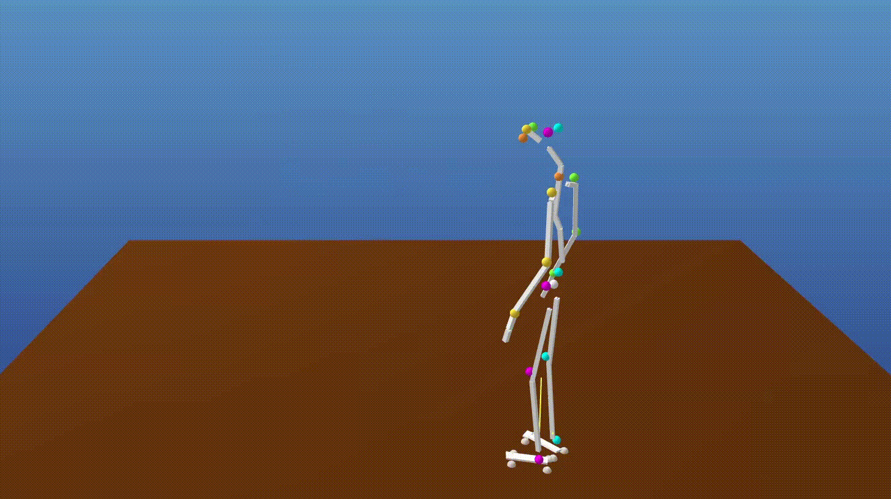

# Estimating 3D Motion & Forces
Zongmian Li, Jiri Sedlar, Justin Carpentier, Ivan Laptev, Nicolas Mansard and Josef Sivic

[[Project Page](https://www.di.ens.fr/willow/research/motionforcesfromvideo/)] [[arXiv](https://arxiv.org/pdf/1904.02683.pdf)] [[Oral Slides](https://www.di.ens.fr/willow/research/motionforcesfromvideo/research/li19mfv/li2019motionforces_slides.pdf)] [[Poster](https://www.di.ens.fr/willow/research/motionforcesfromvideo/research/li19mfv/li2019motionforces_poster.pdf)]



## Description

This repository hosts the estimating stage implementation of the paper: [Estimating 3D Motion and Forces of Person-Object Interactions from Monocular Video](https://arxiv.org/pdf/1904.02683.pdf) *(Best Paper Finalist @ CVPR 2019)*.

As a quick setup, users can compile the trajectory estimator and evaluate its performance by running the demo script using precomputed 2D measurements. 

If you are applying the method to new videos, you'll need the recognition stage to generate 2D measurements from pixels. 
In that case, consider installing the following open-source projects:
- Human 2D poses: use [Openpose](https://github.com/CMU-Perceptual-Computing-Lab/openpose). 
- Human 3D poses (required for trajectory initialization): any SMPL(-X) based pose estimator should be fine. For example, use [HMR](https://github.com/akanazawa/hmr) or [FrankMocap](https://github.com/facebookresearch/frankmocap).
- Contact states: we used [contact-recognizer](https://github.com/zongmianli/contact-recognizer). The [hand-object detector](https://github.com/ddshan/hand_object_detector) is a nice alternative for it's trained on large-scale Internet data and should generalize well to novel scenes. 
- Object 2D keypoints: use [object endpoint recognizer](https://github.com/sedlaj45/endpoints) or any object segmentation model of your choice.

Consider :star: this repo if you find the work relevant.
Feel free to open an [issue](https://github.com/zongmianli/Estimating-3D-Motion-Forces/issues) if you need technical support or have suggestions.

## Installation

First of all, note that we need [CMake](https://cmake.org/) to generate native build files for Ceres and our motion-force estimator. CMake can be install via APT:
```terminal
sudo apt install cmake
```
Use `brew install cmake` if you work on macOS.

### Step I. Install Ceres

You can either download a stable release (Ceres 2.2 or later) from [the official website](http://ceres-solver.org/installation.html) or clone the latest version: 
```terminal
git clone https://ceres-solver.googlesource.com/ceres-solver
cd ceres-solver
```
Follow the instructions in [Ceres installation guide](http://ceres-solver.org/installation.html) to install dependencies, build and install Ceres.
Make sure that Ceres can be found by CMake after `make install`.

### Step II. Build the motion-force estimator

1. First, clone this repo and its submodules (using `--recursive`):
   ```terminal
   git clone --recursive https://github.com/zongmianli/Estimating-3D-Motion-Forces.git
   cd Estimating-3D-Motion-Forces
   ```
2. Create a `conda` environment, using:
   ```terminal
   conda env create -f environment.yml
   conda activate estmf
   ```
   Alternatively, you can try the following steps if `conda` is too slow:
   ```
   conda create --name estmf python=3.8
   conda activate estmf
   ```
   Install [Pinocchio](https://stack-of-tasks.github.io/pinocchio/) and the other dependencies:
   ```
   conda install pinocchio -c conda-forge
   pip install -r requirements.txt
   ```
   Note that [EigenPy](https://github.com/stack-of-tasks/eigenpy) should be available once Pinocchio installed. Install it manually if it's not the case, using `conda install eigenpy -c conda-forge`. EigenPy helps to bind our C++ solver in Python.
   
3. Generate build files using CMake. In `/Estimating-3D-Motion-Forces`, type:
   ```terminal
   mkdir build && cd build
   cmake .. -DCMAKE_BUILD_TYPE=Release
   ```
   Make sure to add `-DCMAKE_BUILD_TYPE=Release` at this stage. Otherwise Ceres will run in debug mode and will be very slow.
   
4. Finally, build the solver for our motion-force estimator:
   ```terminal
   make -j4
   ```
   The process can take a few minutes. Finally you will find the compiled solver in `/Estimating-3D-Motion-Forces/lib/solver.so`. It's callable from Python.

## Example usage
We provide a demo code showing how to use the code. In `/Estimating-3D-Motion-Forces`, run:
```
source scripts/demo.sh
```
This sample sequence is extracted from the [Parkour dataset](https://github.com/zongmianli/Parkour-dataset).

## Citation

If you find this work helpful, please consider citing:
```bibtex
@InProceedings{li2019motionforcesfromvideo,
  author={Zongmian Li and Jiri Sedlar and Justin Carpentier and Ivan Laptev and Nicolas Mansard and Josef Sivic},
  title={Estimating 3D Motion and Forces of Person-Object Interactions from Monocular Video},
  booktitle={Computer Vision and Pattern Recognition (CVPR)},
  year={2019}
}

@article{li2022estimating,         
  title={Estimating 3D Motion and Forces of Human-Object Interactions from Internet Videos},
  author={Zongmian Li and Jiri Sedlar and Justin Carpentier and Ivan Laptev and Nicolas Mansard and Josef Sivic},
  journal={International Journal of Computer Vision},
  volume={130},
  number={2},
  pages={363--383},
  year={2022},
  publisher={Springer}
}
```
